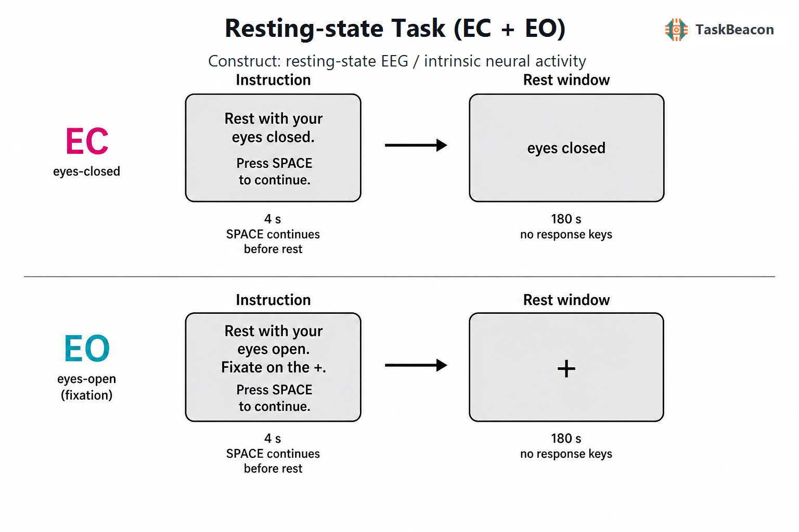

# 睁眼—闭眼静息态采集：内源脑活动的测量逻辑、神经生理证据与解释边界

静息态采集旨在刻画缺少明确外部任务要求时持续存在的脑活动及其组织方式。它解决的核心方法学问题，是如何在不依赖刺激锁定平均或行为正确率的条件下测量自发振荡、网络协同及其个体差异。“静息”只规定较低且相对恒定的外部要求，并不意味着神经活动停止或心理内容为空。清醒水平、视觉输入、自发思维、近期经历和生理噪声仍会改变记录结果（Diaz et al., 2013; Finn, 2021）。因此，闭眼静息（eyes closed, EC）与睁眼静息（eyes open, EO）应被视为两个可重复定义但生理状态不同的采集条件；EC−EO 对比可量化视觉输入及眼状态改变所伴随的信号差异，却不能被直接等同于单一认知过程。

## 1. 范式起源与理论背景

静息态 EEG 的历史起点可追溯至 Berger（1929）对人类头皮电活动的系统记录。他观察到闭眼清醒时明显的后部节律在睁眼后衰减，由此奠定了 α 节律及“α 阻断”研究。此后，静息 EEG 从描述性波形扩展为频谱功率、峰值频率、非周期成分、相位/振幅连接和微状态序列等测量。EC 与 EO 的并置具有双重作用：EC 通常提高 α 节律的可检出性，EO 固定注视则提供较明确的视觉和眼位控制；二者的差异同时包含视觉驱动、警觉变化及眼动伪迹变化。

静息态概念在功能磁共振成像（functional magnetic resonance imaging, fMRI）中的建立进一步改变了该范式的理论地位。Biswal 等（1995）证明，无显式运动任务时运动系统的低频血氧水平依赖（blood-oxygen-level-dependent, BOLD）波动仍具有区域间同步性。Raichle 等（2001）随后提出默认活动模式，推动研究对象由“任务基线”转向具有稳定空间组织的内源活动。同步 EEG-fMRI 研究显示，不同静息网络具有可区分的频率特征，且 α 振荡与警觉和网络耦合相关（Mantini et al., 2007; Sadaghiani et al., 2010）。这些结果支持静息信号含有结构化神经信息，但 BOLD 与头皮 EEG 分别受血流动力学和体积传导等因素制约，跨模态对应关系不能被解释为同一指标的简单复现。

## 2. 采集逻辑、条件与主要指标

EC/EO 静息态没有统一的“经典试次”。常见设计要求参与者在数分钟内保持清醒、放松并减少头动；EC 段闭眼但避免入睡，EO 段持续注视中央标记并减少眨眼与扫视。条件可采用分段、交替或平衡顺序，段间用指导语明确状态切换。采集窗内一般没有按键、正确/错误判定、反馈或依据表现调整难度的控制器。真正需要标准化的参数包括每段时长、条件顺序、EO 的注视要求、照明和屏幕条件、清醒监测、采样与参考方式，以及伪迹处理规则。

EEG 的主要因变量可分为四类。第一类是绝对或相对频谱功率、个体 α 峰频及 EC 到 EO 的 α 衰减；第二类是周期振荡与非周期谱背景参数；第三类是通道或源空间连接；第四类是微状态持续时间、出现频率、覆盖率及状态转移。上述指标回答的问题并不相同。以 EC α 功率较高或 EC−EO α 差值为例，该差异对眼状态敏感，但同时受年龄、警觉、参考电极、频带定义和个体峰频影响。连接指标还受体积传导和源重建影响，微状态指标则依赖聚类方式与模板是否固定。fMRI 通常分析低频 BOLD 振幅、区域同质性及功能连接；它适于刻画网络空间组织，无法仅凭相关连接确立定向或因果作用。

同一原始记录可因指标定义而产生不同结论。绝对功率保留振幅信息，但对头皮—电极阻抗和整体尺度较敏感；相对功率减弱尺度差异，却会使某一频带的变化通过分母传递到其他频带。α 衰减可表示为差值、比值或对数比，各自具有不同的分布和基线依赖。连接分析若直接采用零时滞相关，容易把共同参考和场扩散计入“耦合”。因此，研究方案应预先规定参考方式、伪迹判据、频带边界、有效片段下限、归一化公式和多重比较控制，并同时报告每个条件保留的数据量。EC 与 EO 的伪迹类型不同，若两条件使用相同的剔除阈值却保留不同数量或质量的数据，所得条件差异仍可能含有选择偏差。

采集长度决定估计方差，也会改变状态混合。工作记忆研究中的重复记录表明，静息频谱具有可观重测稳定性，但信度随频带、导联和分析阶段而变（Näpflin et al., 2008）。fMRI 连接估计一般会随有效扫描时长增加而更稳定（Birn et al., 2013）。EEG 方面，一项老年人与轻度认知障碍样本研究将 6 分钟 EC 记录分为前后两个 3 分钟段，未发现后半段出现系统性频谱功率变化；这一结果支持数分钟记录的可行性，但不能排除其他人群或更长记录中的困倦（Kamal et al., 2022）。因而，段长并非越长越好；有效无伪迹数据量与状态稳定性应同时报告。

## 3. 睁闭眼差异的行为与神经科学证据

### 3.1 频谱、警觉与持续状态

静息态不存在可作为任务表现的反应时或正确率。与参与者状态最接近的外部指标包括眼动、眨眼、头动、心率以及困倦评分；EEG 指标则常用于描述而非替代这些状态。Barry 等（2007）在健康成人中发现，从 EC 转为 EO 时皮肤电水平升高，头皮平均 δ、θ、α 和 β 绝对功率下降，其中非 α 频带还呈现区域特异的拓扑变化。该结果说明 EC−EO 不只是全局 α 阻断，也包含视觉加工和唤醒变化。α 功率可作为该操作下的状态敏感指标，但不能脱离条件与拓扑直接标记“放松”或“皮层抑制”。

清醒并非静息窗内自动成立。典型 fMRI 记录中可解码出由清醒向睡眠漂移的过程，且这种漂移系统性改变连接模式（Tagliazucchi & Laufs, 2014）。静息后问卷也揭示了计划、内在言语、躯体感受和视觉意象等多种自发认知表型（Diaz et al., 2013）。因此，EC 更易出现的困倦、EO 的持续注视负荷以及条件固定顺序，都会成为组间或纵向差异的替代解释。需要高状态特异性的研究宜结合眼电、视频或睡眠分期指标，并在分析中剔除或单独建模低警觉片段。

### 3.2 网络组织及跨模态发现

眼状态改变不仅影响局部频谱，也改变网络估计。同步 EEG-fMRI 结果将 α 振荡与维持警觉的内在连接系统联系起来，表明振荡幅度和 BOLD 网络之间存在状态依赖的协变（Sadaghiani et al., 2010）。在 fMRI 中，EC、自由 EO 与 EO 固定注视的平均连接强度差异并非在所有网络中一致；固定注视在若干网络呈现较高重测信度，而初级视觉网络在自由 EO 条件下更可靠（Patriat et al., 2013）。较新的 EC/EO 研究也报告多数所选网络在 EC 时连接增强，并观察到显著性、默认和视觉网络之间的条件差异（Han et al., 2023）。这些结果共同表明眼状态是采集协议的组成部分，跨研究合并时不能将 EC、EO 与固定注视视为可互换的“无任务”基线。

网络与频谱结果还需要区分组水平可重复效应和个体测量信度。静息网络在群体平均中稳定，并不保证每条边或每个微状态参数能可靠排列个体。头皮 EEG 的空间连接尤其可能包含共同参考和瞬时场扩散；fMRI 连接则会受呼吸、心动、头动和全局信号处理影响。空间上重合的网络与时间上相关的振荡支持跨模态关联，尚不足以证明某频带生成某 BOLD 网络，或某网络差异导致特定行为。

## 4. 方法发展与主要应用

静息态的主要应用是建立无需复杂指令或高速反应的神经生理表型，因而适用于儿童、老年人及部分临床人群。它也常被用作任务前基线、干预前后比较和大型队列的个体差异指标。临床研究已在抑郁、精神病性障碍、注意缺陷多动障碍和认知退化中报告频谱异常，但频带边界、用药、共病、年龄与眼状态差异造成显著异质性；现有证据主要支持群体关联，尚不能把单次静息 EEG 直接用作个体诊断（Newson & Thiagarajan, 2019）。

发展研究同样要求精细控制样本构成。儿童大样本的 EC/EO 定量 EEG 分析发现，性别差异可分布于功率、不对称和相干性等多项指标，年龄和头围也需作为协变量（Modarres et al., 2023）。老年与轻度认知障碍研究中，较高 θ 功率与较低总体认知有关，但横断面关联不能说明脑节律减慢是认知下降的原因（Kamal et al., 2022）。对运动训练、睡眠、药物或神经调控效应的研究，还应加入匹配对照、重复测量与预注册分析，避免从多导联、多频带探索中选择性报告结果。

近年来，研究重点由单一频带均值扩展到连接、微状态和内在神经时间尺度。该扩展增加了对短时动态的描述能力，也提高了分析选择的自由度。EEG-BIDS 为原始数据、事件与采集元数据提供标准化组织方式，有利于跨中心复现（Pernet et al., 2019）。标准化数据结构不能替代状态控制；EC/EO 指令、段长、顺序、注视形式、清醒监测和有效数据量仍需作为核心方法信息公开。

## 5. 信度、效度与解释边界

静息 EEG 的信度具有明显的指标层级。固定全局模板时，EC 微状态持续时间、频率和覆盖率可获得较高重测信度；逐记录单独估计模板时信度明显降低，说明分析策略本身会改变测量属性（Khanna et al., 2014）。在较大规模青年与老年样本中，头皮及源空间功率、个体 α 峰功率与频率总体达到良好至优秀的重测信度，而微状态和连接仅部分达到预设标准（Popov et al., 2023）。2025 年研究进一步发现，EC 与 EO 下由自相关窗估计的内在神经时间尺度在全脑水平具有良好信度，但不同指标和电极间仍有差异（Tang et al., 2025）。由此，研究设计不能把“静息 EEG 可靠”作为整体判断；应针对目标指标、时间间隔、眼状态和分析管线报告信度。

构念效度的主要限制来自“静息”缺少唯一心理操作。EC−EO 对比能稳定操纵视觉输入与眼状态，却同时改变唤醒、眨眼、眼球运动、注视努力和入睡倾向。静息前后的任务、咖啡因、昼夜时间及被试对指令的理解也会改变结果（Finn, 2021）。固定条件顺序会使条件差异与时间、适应或疲劳部分混杂；随机或平衡顺序虽能降低该问题，却可能引入切换残留。研究者应依据主要假设选择设计：若目标是 α 衰减，可在统一照明下采集成对 EC/EO 段；若目标是稳定的个体网络，应增加有效数据量、监测清醒并预先限定去伪迹和连接估计方法。

## 6. TaskBeacon 中的静息态实现

### 6.1 任务资源与访问入口

| 资源 | ID | 用途 | 地址 |
|---|---|---|---|
| 完整实验实现 | T000010 | PsychoPy/PsyFlow 的中文 EEG 静息态采集，成熟度标记为 piloted | [GitHub 源码](https://github.com/TaskBeacon/T000010-rest) |
| 浏览器流程预览 | H000010 | 行为型 HTML 原型，用于体验条件与呈现流程，不采集 EEG | [GitHub 源码](https://github.com/TaskBeacon/H000010-rest) |
| 在线体验 | H000010 | 公开浏览器运行入口 | [运行预览](https://taskbeacon.github.io/psyflow-web/?task=H000010-rest) |

T000010 是完整 EEG 实验实现；H000010 的任务清单将采集类型标为 behavior、成熟度标为 prototype。H000010 当前公开配置保留 1 个区块、4 个条件段及每段 180 秒的参数，但浏览器无法替代 EEG 设备、触发同步和实验室环境控制，因而只能视为流程预览。

### 6.2 实现流程与关键参数

TaskBeacon 当前版本在总说明页由空格键启动，随后进行 3 秒倒计时。单一区块按 EC→EO→EC→EO 的固定顺序生成 4 个条件段。每段先呈现 4 秒条件指导语，并可同步播放中文语音；随后进入 180 秒静息窗。EC 窗显示“请闭眼”，EO 窗显示黑色中央“+”。静息窗不接受任何反应，也不计算正确率、得分或反馈；任务没有自适应控制器。每个条件的开始与结束均设置独立事件标记，主要输出是条件、指导阶段和静息阶段的时序记录，EEG 本身由外部采集系统同步获得。两次 EC 与两次 EO 各累积 360 秒静息数据，固定交替有助于把两种状态分布到记录前后，但首段恒为 EC，不能完全消除顺序效应。

**图 1. TaskBeacon T000010 静息态采集流程与参数。** 全局说明页由空格键启动任务，3 秒倒计时后在一个区块内依次执行 EC、EO、EC、EO 四个条件段。每段包含固定 4 秒的条件指导语和 180 秒静息窗；当前源码中的条件指导语在 4 秒后自动进入静息窗，空格不是静息段反应规则。EC 指导参与者闭眼、放松、保持头部不动并保持清醒，静息窗显示“请闭眼”；EO 指导参与者睁眼注视中央黑色“+”、减少眼动和眨眼，静息窗持续显示“+”。静息窗的有效按键集合为空，不因按键提前终止；无正确/错误判定、积分、反馈或自适应参数。EC 与 EO 各在开始和 180 秒超时时发送对应的 onset/offset 标记。图中每类条件画出一次流程，实际运行各重复两次。

这一实现适合估计每种眼状态下的频谱、微状态或预先规定的连接指标，并计算 EC−EO 的状态差异。解释时应保留三个限制：固定顺序使眼状态与记录时间部分相关；仓库流程未设置在线困倦判定；日志中的“trial”是条件采集段的运行单位，不代表具有刺激—反应—反馈结构的传统行为试次。

## 参考文献

Barry, R. J., Clarke, A. R., Johnstone, S. J., Magee, C. A., & Rushby, J. A. (2007). EEG differences between eyes-closed and eyes-open resting conditions. *Clinical Neurophysiology, 118*(12), 2765–2773. https://doi.org/10.1016/j.clinph.2007.07.028

Berger, H. (1929). Über das Elektrenkephalogramm des Menschen. *Archiv für Psychiatrie und Nervenkrankheiten, 87*(1), 527–570. https://doi.org/10.1007/BF01797193

Birn, R. M., Molloy, E. K., Patriat, R., Parker, T., Meier, T. B., Kirk, G. R., Nair, V. A., Meyerand, M. E., & Prabhakaran, V. (2013). The effect of scan length on the reliability of resting-state fMRI connectivity estimates. *NeuroImage, 83*, 550–558. https://doi.org/10.1016/j.neuroimage.2013.05.099

Biswal, B., Yetkin, F. Z., Haughton, V. M., & Hyde, J. S. (1995). Functional connectivity in the motor cortex of resting human brain using echo-planar MRI. *Magnetic Resonance in Medicine, 34*(4), 537–541. https://doi.org/10.1002/mrm.1910340409

Diaz, B. A., Van Der Sluis, S., Moens, S., Benjamins, J. S., Migliorati, F., Stoffers, D., Den Braber, A., Poil, S.-S., Hardstone, R., Van't Ent, D., Boomsma, D. I., De Geus, E., Mansvelder, H. D., Van Someren, E. J., & Linkenkaer-Hansen, K. (2013). The Amsterdam Resting-State Questionnaire reveals multiple phenotypes of resting-state cognition. *Frontiers in Human Neuroscience, 7*, Article 446. https://doi.org/10.3389/fnhum.2013.00446

Finn, E. S. (2021). Is it time to put rest to rest? *Trends in Cognitive Sciences, 25*(12), 1021–1032. https://doi.org/10.1016/j.tics.2021.09.005

Han, J., Zhou, L., Wu, H., Huang, Y., Qiu, M., Huang, L., Lee, C., Lane, T. J., & Qin, P. (2023). Eyes-open and eyes-closed resting state network connectivity differences. *Brain Sciences, 13*(1), Article 122. https://doi.org/10.3390/brainsci13010122

Kamal, F., Campbell, K., & Taler, V. (2022). Effects of the duration of a resting-state EEG recording in healthy aging and mild cognitive impairment. *Clinical EEG and Neuroscience, 53*(5), 443–451. https://doi.org/10.1177/1550059420983624

Khanna, A., Pascual-Leone, A., & Farzan, F. (2014). Reliability of resting-state microstate features in electroencephalography. *PLoS ONE, 9*(12), e114163. https://doi.org/10.1371/journal.pone.0114163

Mantini, D., Perrucci, M. G., Del Gratta, C., Romani, G. L., & Corbetta, M. (2007). Electrophysiological signatures of resting state networks in the human brain. *Proceedings of the National Academy of Sciences, 104*(32), 13170–13175. https://doi.org/10.1073/pnas.0700668104

Modarres, M., Cochran, D., Kennedy, D. N., & Frazier, J. A. (2023). Comparison of comprehensive quantitative EEG metrics between typically developing boys and girls in resting state eyes-open and eyes-closed conditions. *Frontiers in Human Neuroscience, 17*, Article 1237651. https://doi.org/10.3389/fnhum.2023.1237651

Näpflin, M., Wildi, M., & Sarnthein, J. (2008). Test–retest reliability of EEG spectra during a working memory task. *NeuroImage, 43*(4), 687–693. https://doi.org/10.1016/j.neuroimage.2008.08.028

Newson, J. J., & Thiagarajan, T. C. (2019). EEG frequency bands in psychiatric disorders: A review of resting state studies. *Frontiers in Human Neuroscience, 12*, Article 521. https://doi.org/10.3389/fnhum.2018.00521

Patriat, R., Molloy, E. K., Meier, T. B., Kirk, G. R., Nair, V. A., Meyerand, M. E., Prabhakaran, V., & Birn, R. M. (2013). The effect of resting condition on resting-state fMRI reliability and consistency: A comparison between resting with eyes open, closed, and fixated. *NeuroImage, 78*, 463–473. https://doi.org/10.1016/j.neuroimage.2013.04.013

Pernet, C. R., Appelhoff, S., Gorgolewski, K. J., Flandin, G., Phillips, C., Delorme, A., & Oostenveld, R. (2019). EEG-BIDS, an extension to the brain imaging data structure for electroencephalography. *Scientific Data, 6*(1), Article 103. https://doi.org/10.1038/s41597-019-0104-8

Popov, T., Tröndle, M., Baranczuk-Turska, Z., Pfeiffer, C., Haufe, S., & Langer, N. (2023). Test–retest reliability of resting-state EEG in young and older adults. *Psychophysiology, 60*(7), e14268. https://doi.org/10.1111/psyp.14268

Raichle, M. E., MacLeod, A. M., Snyder, A. Z., Powers, W. J., Gusnard, D. A., & Shulman, G. L. (2001). A default mode of brain function. *Proceedings of the National Academy of Sciences, 98*(2), 676–682. https://doi.org/10.1073/pnas.98.2.676

Sadaghiani, S., Scheeringa, R., Lehongre, K., Morillon, B., Giraud, A.-L., & Kleinschmidt, A. (2010). Intrinsic connectivity networks, alpha oscillations, and tonic alertness: A simultaneous electroencephalography/functional magnetic resonance imaging study. *The Journal of Neuroscience, 30*(30), 10243–10250. https://doi.org/10.1523/JNEUROSCI.1004-10.2010

Tagliazucchi, E., & Laufs, H. (2014). Decoding wakefulness levels from typical fMRI resting-state data reveals reliable drifts between wakefulness and sleep. *Neuron, 82*(3), 695–708. https://doi.org/10.1016/j.neuron.2014.03.020

Tang, X., Wang, S., Xu, X., Luo, W., & Zhang, M. (2025). Test–retest reliability of resting-state EEG intrinsic neural timescales. *Cerebral Cortex, 35*(2), bhaf034. https://doi.org/10.1093/cercor/bhaf034
